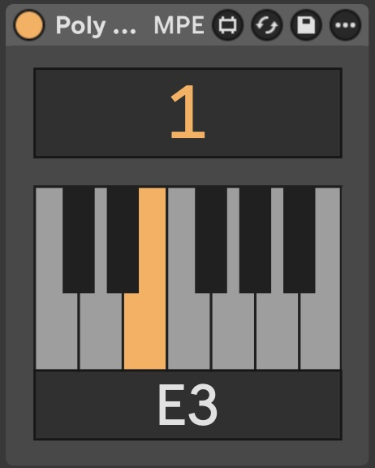

# Poly Zen

> MPE voice filter for dozens of voices, a [Max for Live](https://www.ableton.com/en/live/max-for-live/) device for isolating individual voices from polyphony

## Licence

Released under [GPL v3 license](LICENSE). 

Based on [zsteinkamp/m4l-ChordRipper](https://github.com/zsteinkamp/m4l-ChordRipper), notable changes: 
- added MPE support, 
- extended from 8 to 12 voices, 
- removed chanel selector, 
- remove send/forward/receive, 
- removed telemetry
